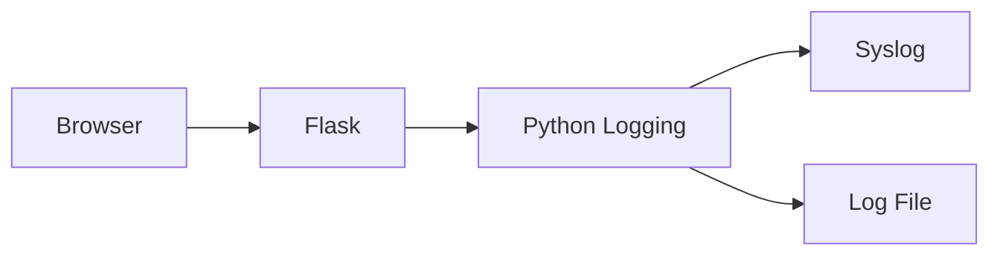
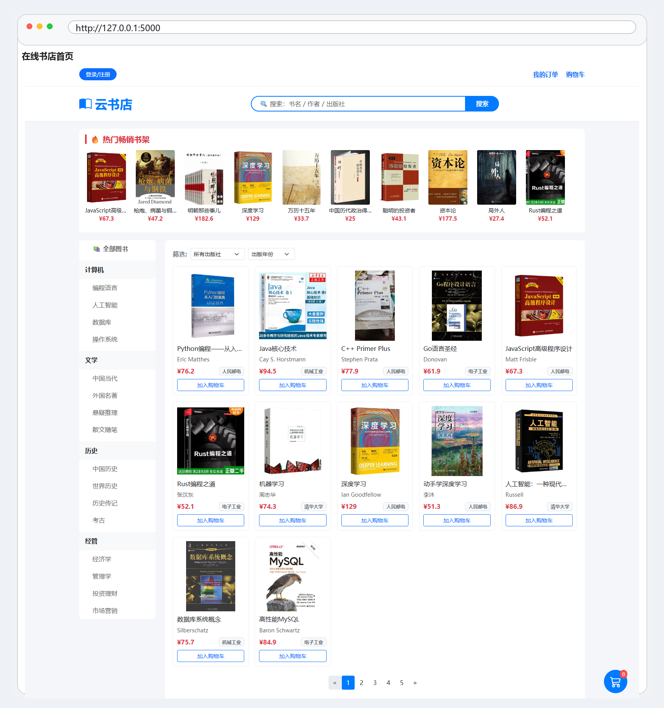
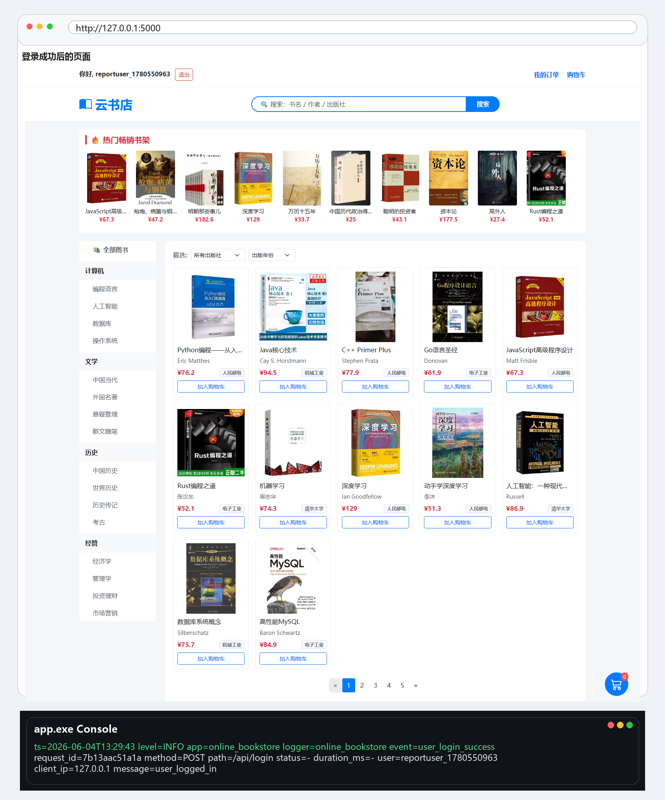
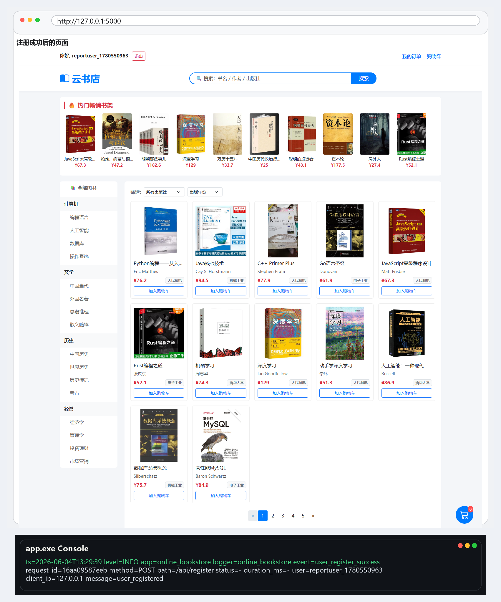
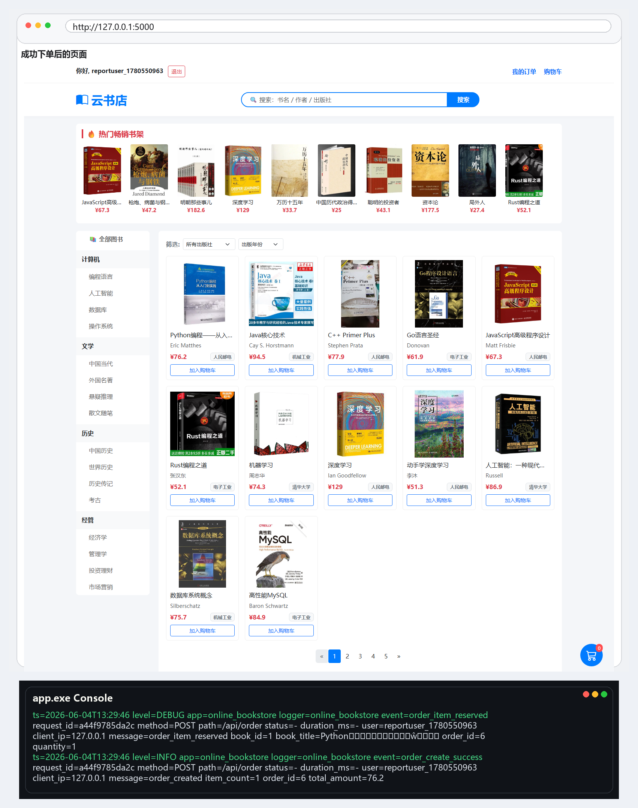
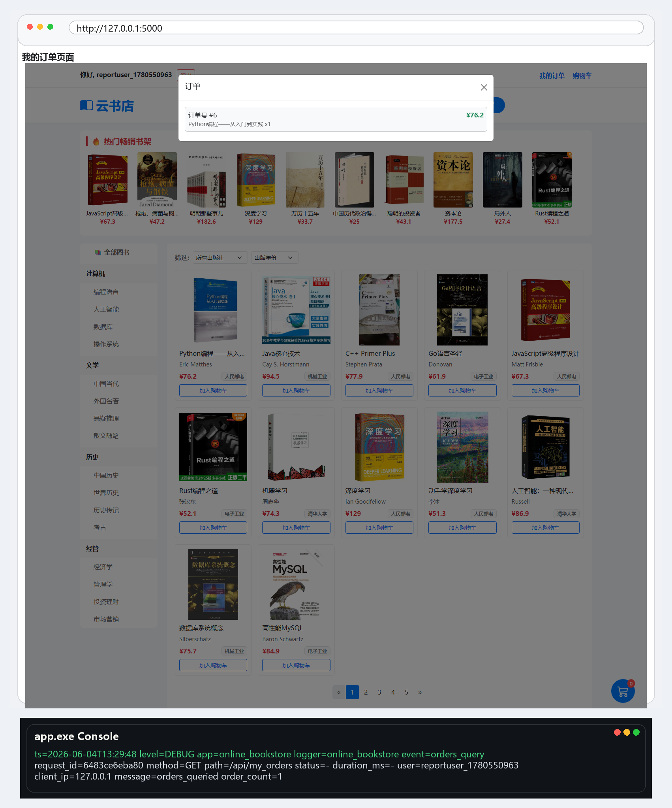
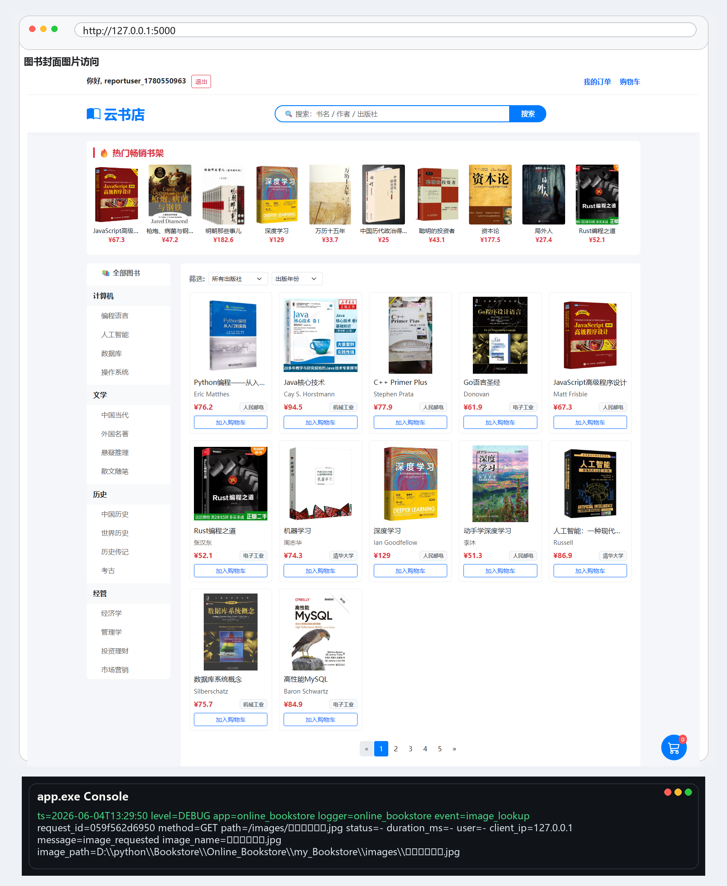
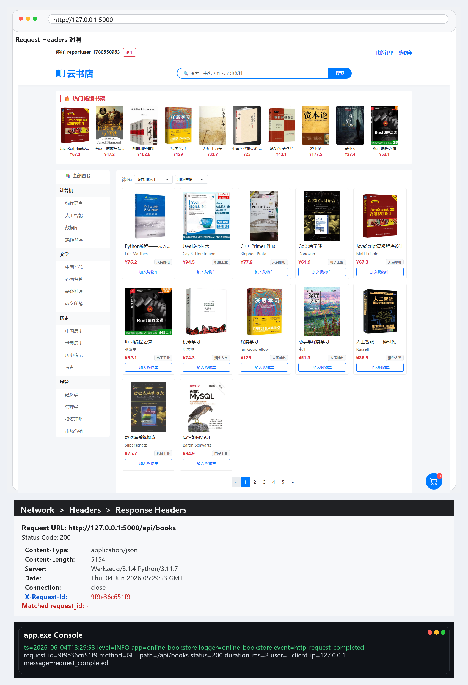
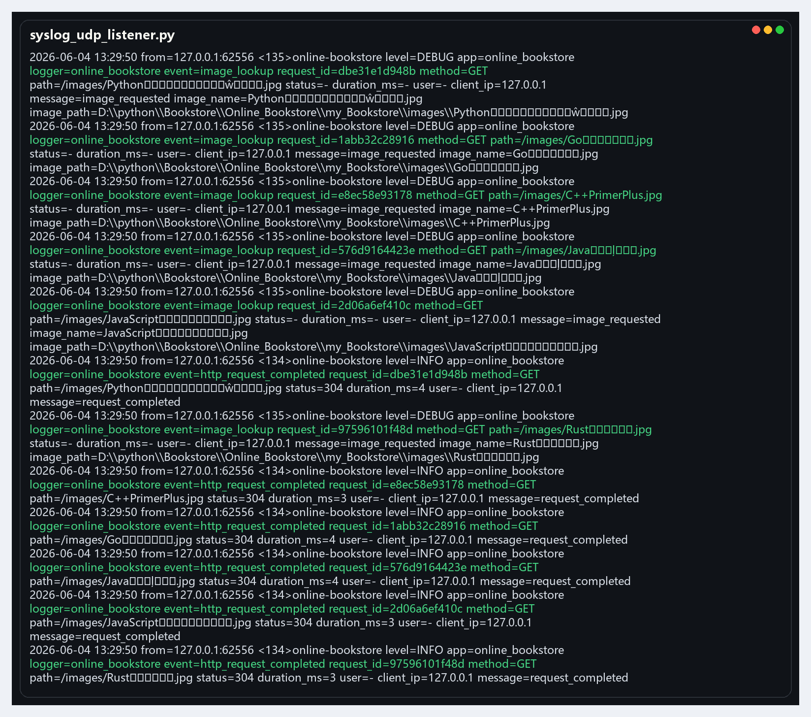
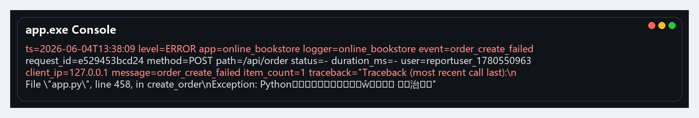

# ??????????????

## 1. ????

?????????????? Syslog ??????????????????????????????????????????????????

## 2. ????

???

- `Browser` ?????????????????
- `Flask` ????????????????????????????
- `Python Logging` ??????????????????????????
- `Syslog` ???????????????????????????
- `Log File` ??????????????/???????????????????

## 3. ????

### request_id

- ?? HTTP ??? `before_request` ?????? `request_id`?
- `request_id` ???????????????? `X-Request-ID` ??????
- ?????????????????syslog ????????????

### before_request

- ?????????????
- ??? `request_id`???????????????
- ??? `after_request`?`teardown_request` ????????

### after_request

- ???????? `duration_ms`?
- ????????????
  - `<400` ?? `INFO`
  - `>=400` ?? `WARNING`
  - `>=500` ?? `ERROR`
- ???????? `X-Request-ID`?

### teardown_request

- ????????????
- ??????? `request_id`?????????`traceback` ??????
- ?????????? JSON????????????????

### SysLogHandler

- ?? `logging.handlers.SysLogHandler` ?????? `127.0.0.1:5514/udp`?
- ?????????? `host`?`port`?`proto`?`facility`?
- ?????????????????????????

## 4. ????

### ????

- ?????? `event=user_login_success`
- ?????? `event=user_login_failed`

### ????

- ?????? `event=user_register_success`
- ??????? `event=user_register_conflict`

### ????

- ?????? `event=order_create_success`
- ????????? `event=order_item_reserved`

### ????

- ???????? `event=orders_query`
- ?????????? `event=http_request_completed`

### ??????

- ???????? `event=image_lookup`

### ????

- ??????????? `event=order_create_failed`
- ?????? `level=ERROR`?`request_id`?`traceback`

## 5. ????

### 01 ??

### 02 ????

### 03 ????

### 04 ????

### 05 ????

### 06 ????

### 07 Request ID ???

### 08 Syslog ??

### 09 ????

## 6. ??????

### ????

- `ts`???????
- `level`??????? `INFO`?`DEBUG`?`WARNING`?`ERROR`?
- `app`???????? `online_bookstore`?
- `logger`?????? logger ???
- `event`?????????????????????????
- `request_id`???????????????
- `method`?HTTP ???? `GET`?`POST`?
- `path`??????
- `status`?HTTP ????
- `duration_ms`?????????????
- `user`????????????? `-`?
- `client_ip`???? IP ???
- `message`????????

### ??????

- `order_id`??????
- `item_count`???????
- `total_amount`???????
- `book_id` / `book_title` / `quantity`?????????????
- `image_name` / `image_path`???????????
- `traceback`??????????????????

### ????

- ?????????????404?500 ????
- ??????????????????
- ???????????????????
- ???????????????????
- `request_id` ???????????????????????

## 7. ????

????? Python ??????????????????????????????? Syslog ????????? `request_id` ???????????????????????????????????????????????????????????????????????????????? Syslog ?????????????????????????????????
